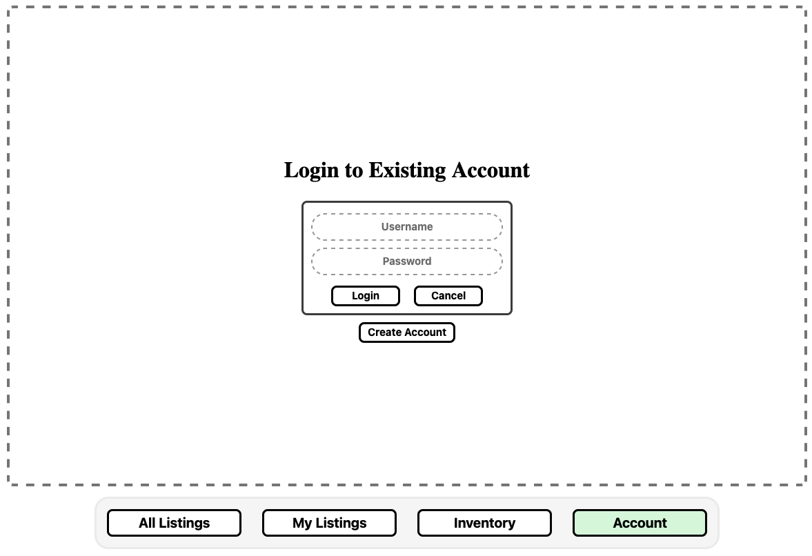
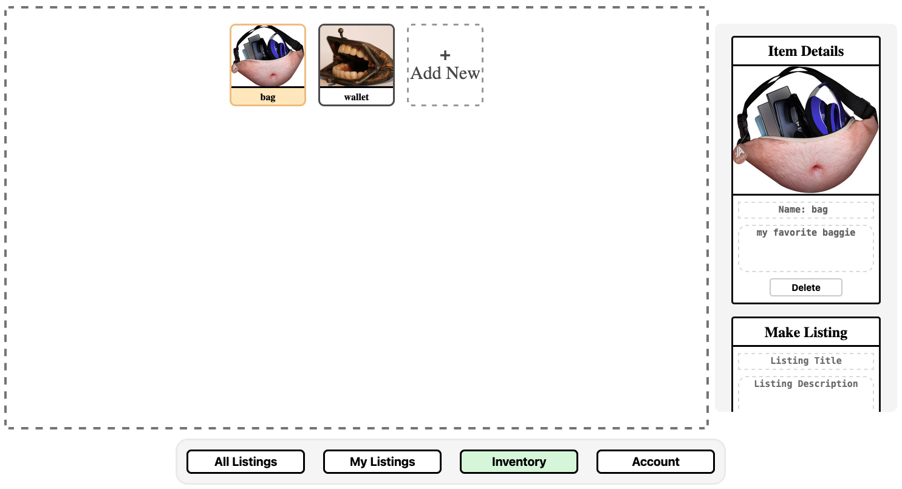
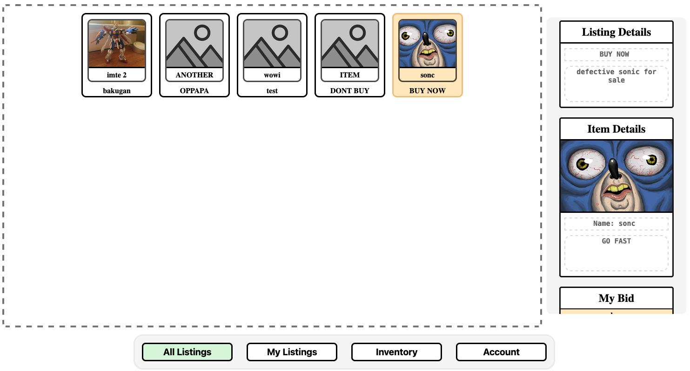

# `--- Bartering ---`
## Item Bartering Application

Users fill up their "inventory" by uploading photos and item descriptions for things they are willing to trade. They are then able to create a bid listing for any item in their inventory. Bid listings are displayed publicly for all other users to see. Other users are able to bid on publicly listed items using one of their own items. 

The bid listing owner can look through all the bids, selecting the best one. The user whose bid got selected gets his item swapped with the one in the listing.

***

### ``Account Page``
- #### Used to manage account creation, login, and logout


***

### ``Inventory Page``
- #### Used to add and remove items from the inventory
- #### This is also where listings are made


***

### ``Listings Page``
- #### This is where everyting to do with bidding takes place
- #### Users use their items as bids on listings
- #### The listing owner chooses the best bid


***

# `--- Frontend Setup ---`

### Go to Directory
```sh
cd Bartering/bartering-client
```

### Install Project Dependencies 
```sh
npm install
```

### Compile and Hot-Reload for Development

```sh
npm run dev
```

### This will raise the client web-app on `http://localhost:5173/app`

### Note: The back-end and account are `REQUIRED` to use the application


# `--- Back-End Setup ---`
`Prerequisites:`
***This project requires the dotnet entity framework***

More details can be found [here](https://github.com/cen4090l-sp25-group20/Bartering/tree/task275/api)

### Go to Directory
```sh
cd Bartering/api/src/Bartering.Api
```

### Raise the Server
```sh
sudo docker compose up --build
```

### This will raise the back-end server on `http://localhost:5096`

