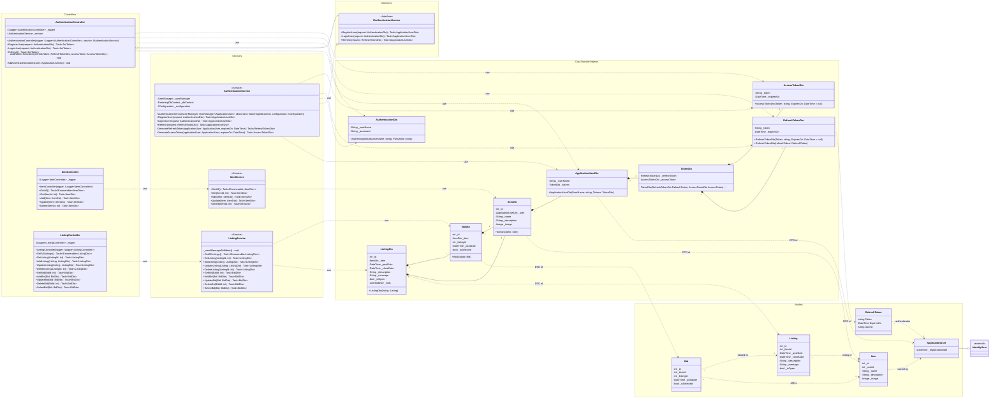

```mermaid
---
Bartering Class Diagram
---
classDiagram
    direction LR

    namespace Controllers{

        class AuthenticationController{
            -ILogger~AuthenticationController~ _logger
            -IAuthenticationService _service
            +AuthenticationController(logger: ILogger~AuthenticationController~, service: IAuthenticationService)
            +RegisterUser(request: AuthenticationDto) Task~JwtToken~
            +LoginUser(request: AuthenticationDto) Task~JwtToken~
            +Refresh() Task~JwtToken~
            -AddTokensToCookies(refreskToken: RefreshTokenDto, accessToken: AccessTokenDto) void
            -AddUserDataToCookies(user: ApplicationUserDto) void
        }

        class ItemController{
            -ILogger~ItemController~ _logger
            +ItemController(logger: ILogger~ItemController~)
            +GetAll() Task~IEnumerable~ItemDto~~
            +Get(ItemId: int) Task~ItemDto~
            +Add(Item: ItemDto) Task~ItemDto~
            +Update(Item: ItemDto) Task~ItemDto~
            +Delete(ItemId: int) Task~ItemDto~
        }

        class ListingController{
            -ILogger~ListingController~ _logger
            +ListingController(logger: ILogger~ListingController~)
            +GetAllListings() Task~IEnumerable~ListingDto~~
            +GetListing(ListingId: int) Task~ListingDto~
            +AddListing(Listing: ListingDto) Task~ListingDto~
            +UpdateListing(Listing: ListingDto) Task~ListingDto~
            +DeleteListing(ListingId: int) Task~ListingDto~
    
            +GetBid(BidId: int) Task~BidDto~
            +AddBid(Bid: BidDto) Task~BidDto~
            +UpdateBid(Bid: BidDto) Task~BidDto~
            +DeleteBid(BidId: int) Task~BidDto~
    
            +SelectBid(Bid: BidDto) Task~BidDto~
        }
    }

    namespace Interfaces{
        class IAuthenticationService{
            <<Interface>>
            +RegisterUser(request: AuthenticationDto) Task~ApplicationUserDto~
            +LoginUser(request: AuthenticationDto) Task~ApplicationUserDto~
            +Refresh(request: RefreshTokenDto) Task~ApplicationUserDto~
        }
    }

    namespace Services{

        class AuthenticationService{
            <<Service>>
            - UserManager<ApplicationUser> _userManager
            - BarteringDbContext _dbContext
            - IConfiguration _configuration
            +AuthenticationService(userManager: UserManager~ApplicationUser~, dbContext: BarteringDbContext, configuration: IConfiguration)
            +RegisterUser(request: AuthenticationDto) Task~ApplicationUserDto~
            +LoginUser(request: AuthenticationDto) Task~ApplicationUserDto~
            +Refresh(request: RefreshTokenDto) Task~ApplicationUserDto~
            -GenerateRefreshToken(applicationUser: ApplicationUser, expiresOn: DateTime) Task~RefreshTokenDto~
            -GenerateAccessToken(applicationUser: ApplicationUser, expiresOn: DateTime) Task~AccessTokenDto~
        }

        class ItemService{
            <<Service>>
            +GetAll() Task~IEnumerable~ItemDto~~
            +Get(ItemId: int) Task~ItemDto~
            +Add(Item: ItemDto) Task~ItemDto~
            +Update(Item: ItemDto) Task~ItemDto~
            +Delete(ItemId: int) Task~ItemDto~
        }

        class ListingService{
            <<Service>>
            -_sendMessageToBidder() void
            +GetAllListings() Task~IEnumerable~ListingDto~~
            +GetListing(ListingId: int) Task~ListingDto~
            +AddListing(Listing: ListingDto) Task~ListingDto~
            +UpdateListing(Listing: ListingDto) Task~ListingDto~
            +DeleteListing(ListingId: int) Task~ListingDto~

            +GetBid(BidId: int) Task~BidDto~
            +AddBid(Bid: BidDto) Task~BidDto~
            +UpdateBid(Bid: BidDto) Task~BidDto~
            +DeleteBid(BidId: int) Task~BidDto~

            +SelectBid(Bid: BidDto) Task~BidDto~
        }
    }

    namespace DataTransferObjects{

        class ApplicationUserDto{
            -String _userName
            -TokenDto _tokens
            +ApplicationUserDto(UserName: string, Tokens: TokenDto)
        }

        class AuthenticationDto{
            -String _userName
            -String _password
            +AuthenticationDto(UserName: string, Password: string)
        }

        class AccessTokenDto{
            -String _token
            -DateTime _expiresOn
            +AccessTokenDto(Token: string, ExpiresOn: DateTime = null)
        }

        class RefreshTokenDto{
            -String _token
            -DateTime _expiresOn
            +RefreshTokenDto(Token: string, ExpiresOn: DateTime = null)
            +RefreshTokenDto(refreshToken: RefreshToken)
        }

        class TokenDto{
            RefreshTokenDto _refreshToken
            AccessTokenDto _accessToken
            TokenDto(RefreshTokenDto RefreshToken, AccessTokenDto AccessToken);
        }

        class ItemDto{
            -int _id
            -ApplicationUserDto _user
            -String _name
            -String _description
            -Image _image
            +ItemDto(item: Item)
        }

        class ListingDto{
            -int _id
            -ItemDto _item
            -DateTime _postDate
            -DateTime _closeDate
            -String _description
            -String _message
            -bool _isOpen
            -List~BidDto~ _bids
            +ListingDto(listing: Listing)
        }

        class BidDto{
            -int _id
            -ItemDto _item
            -int _listingId
            -DateTime _postDate
            -bool _isSelected
            +BidDto(bid: Bid)
        }
    }

    namespace Models{

        class ApplicationUser{
            -DateTime _registrationDate
        }

        class RefreshToken{
            -string Token 
            -DateTime ExpiresOn 
            -string UserId 
        }

        class Item{
            -int _id
            -int _userId
            -String _name
            -String _description
            -Image _image
        }

        class Listing{
            -int _id
            -int _itemId
            -DateTime _postDate
            -DateTime _closeDate
            -String _description
            -String _message
            -bool _isOpen
        }

        class Bid{
            -int _id
            -int _itemId
            -int _listingId
            -DateTime _postDate
            -bool _isSelected
        }
    }

    class IdentityUser{
        <<external>>
    }

    %% RELATIONS

    %% User
    ApplicationUser --|> IdentityUser
    ApplicationUserDto ..> ApplicationUser : DTO of
    AuthenticationController ..> ApplicationUserDto : use
    AuthenticationService ..> ApplicationUserDto : use
    AuthenticationController o-- IAuthenticationService
    AuthenticationService ..|> IAuthenticationService

    %% Authentication / Tokens
    AuthenticationController ..> AuthenticationDto : use
    AuthenticationService ..> AuthenticationDto : use

    RefreshTokenDto ..> RefreshToken : DTO of
    AuthenticationController ..> RefreshTokenDto : use
    AuthenticationService ..> RefreshTokenDto : use
    RefreshToken "*" ..> "1" ApplicationUser : authenticates

    AuthenticationController ..> AccessTokenDto : use
    AuthenticationService ..> AccessTokenDto : use

    ApplicationUserDto "1" *-- "1" TokenDto
    TokenDto "1" *-- "1" RefreshTokenDto
    TokenDto "1" *-- "1" AccessTokenDto

    %% Item
    ItemController ..> ItemService : use
    ItemService ..> ItemDto : use
    ItemDto ..> Item : DTO of
    ItemDto "1" *-- "1" ApplicationUserDto
    Item "*" ..> "1" ApplicationUser : owned by

    %% Listing and Bid
    ListingController ..> ListingService : use
    ListingService ..> ListingDto : use
    ListingDto ..> Listing : DTO of
    ListingDto "1" *-- "1" ItemDto
    Listing "*" ..> "1" Item : listing of

    ListingService ..> BidDto : use
    ListingDto "1" *-- "*" BidDto
    BidDto ..> Bid : DTO of
    BidDto "1" *-- "1" ItemDto 
    Bid "1" ..> "1" Item : offers
    Bid "*" ..> "1" Listing : placed on

```
