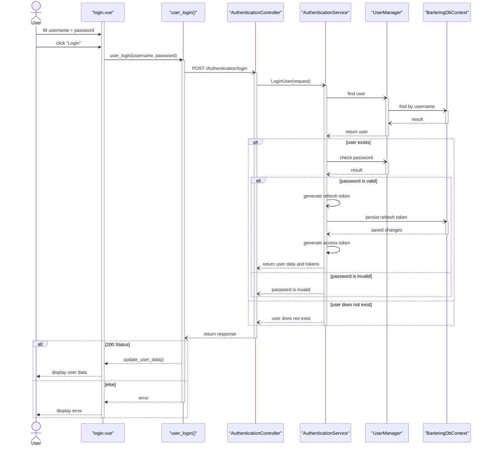

```mermaid
sequenceDiagram
    actor User
    participant loginVue as "login.vue"
    participant login as "user_login()"
    participant AuthController as "AuthenticationController"
    participant AuthService as "AuthenticationService"
    participant UserManager as "UserManager"
    participant DbContext as "BarteringDbContext"

    activate loginVue
    User->>loginVue: fill username + password
    User->>loginVue: click "Login"
    loginVue->>login: user_login(username, password)
    activate login
    login-)AuthController: POST /Authentication/login
    activate AuthController

    AuthController-)AuthService: LoginUser(request)
    activate AuthService
    AuthService-)UserManager: find user
    activate UserManager
    UserManager-)DbContext: find by username
    activate DbContext
    DbContext--)UserManager: result
    deactivate DbContext
    UserManager--)AuthService: return user
    deactivate UserManager

    alt user exists

        AuthService-)UserManager: check password
        activate UserManager
        UserManager--)AuthService: result
        deactivate UserManager
        alt password is valid

            AuthService-)AuthService: generate refresh token
            AuthService-)DbContext: persist refresh token
            activate DbContext
            DbContext--)AuthService: saved changes
            deactivate DbContext
            AuthService->>AuthService: generate access token
            AuthService--)AuthController: return user data and tokens
        
        else password is invalid
            AuthService--)AuthController: password is invalid
        end

    else user does not exist
        AuthService--)AuthController: user does not exist
    end
    deactivate AuthService

    AuthController--)login: return response
    deactivate AuthController

    alt 200 Status
        login-->>loginVue: update_user_data()
        loginVue-->>User: display user data
    else else
        login-->>loginVue: error
        deactivate login
        loginVue-->>User: display error
    end

    deactivate loginVue
```
