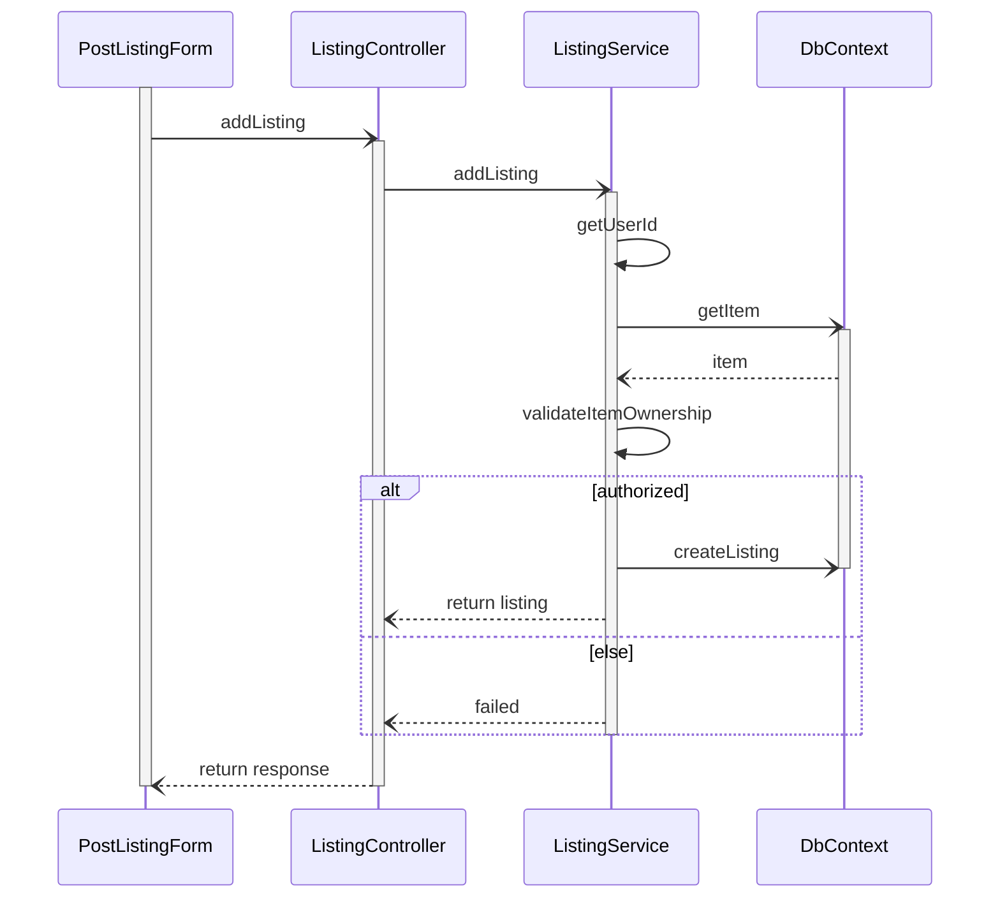

```mermaid
sequenceDiagram
    participant PostListingForm
    participant ListingController
    participant ListingService
    participant DbContext

    activate PostListingForm
    PostListingForm-)ListingController : addListing

    activate ListingController
    ListingController-)ListingService : addListing

    activate ListingService 
    ListingService->>ListingService : getUserId
    ListingService-)DbContext : getItem

    activate DbContext
    DbContext--)ListingService : item
    ListingService->>ListingService: validateItemOwnership
    
    alt authorized
    ListingService-)DbContext : createListing
    deactivate DbContext
    ListingService--)ListingController : return listing 
    else else
    ListingService--)ListingController : failed 
    
    end
    deactivate ListingService

    ListingController--)PostListingForm : return response
    deactivate ListingController
    deactivate PostListingForm
```
