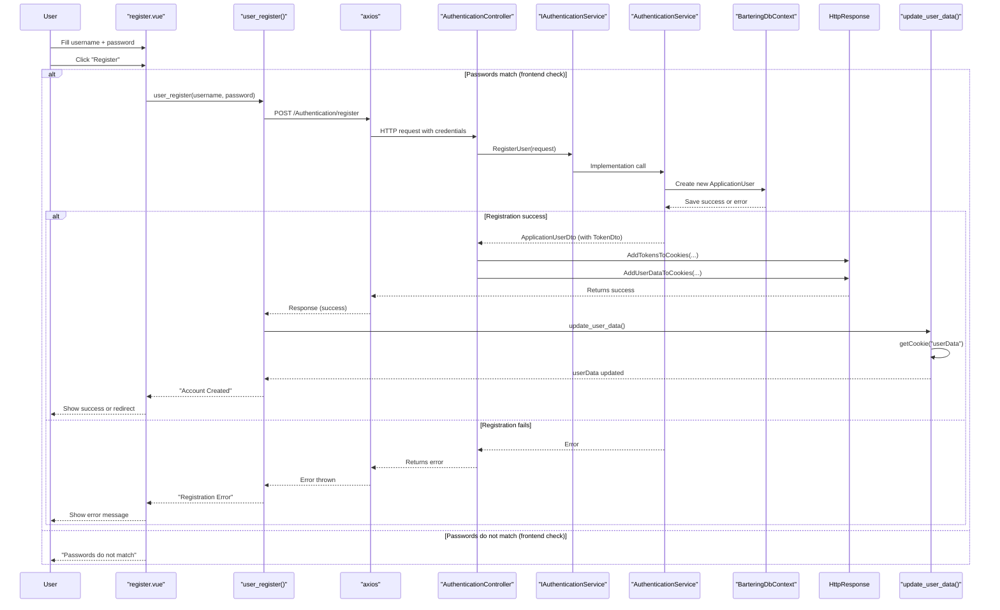

```mermaid
sequenceDiagram
    participant User
    participant registerVue as "register.vue"
    participant userRegister as "user_register()"
    participant Axios as "axios"
    participant AuthController as "AuthenticationController"
    participant IAuthService as "IAuthenticationService"
    participant AuthService as "AuthenticationService"
    participant DbContext as "BarteringDbContext"
    participant HttpResponse
    participant updateUserData as "update_user_data()"

    User->>registerVue: Fill username + password
    User->>registerVue: Click "Register"

    alt Passwords match (frontend check)
        registerVue->>userRegister: user_register(username, password)
        userRegister->>Axios: POST /Authentication/register
        Axios->>AuthController: HTTP request with credentials

        AuthController->>IAuthService: RegisterUser(request)
        IAuthService->>AuthService: Implementation call

        AuthService->>DbContext: Create new ApplicationUser
        DbContext-->>AuthService: Save success or error

        alt Registration success
            AuthService-->>AuthController: ApplicationUserDto (with TokenDto)
            AuthController->>HttpResponse: AddTokensToCookies(...)
            AuthController->>HttpResponse: AddUserDataToCookies(...)
            HttpResponse-->>Axios: Returns success
            Axios-->>userRegister: Response (success)

            userRegister->>updateUserData: update_user_data()
            updateUserData->>updateUserData: getCookie("userData")
            updateUserData-->>userRegister: userData updated
            userRegister-->>registerVue: "Account Created"
            registerVue-->>User: Show success or redirect

        else Registration fails
            AuthService-->>AuthController: Error
            AuthController-->>Axios: Returns error
            Axios-->>userRegister: Error thrown
            userRegister-->>registerVue: "Registration Error"
            registerVue-->>User: Show error message
        end

    else Passwords do not match (frontend check)
        registerVue-->>User: "Passwords do not match"
    end
```
